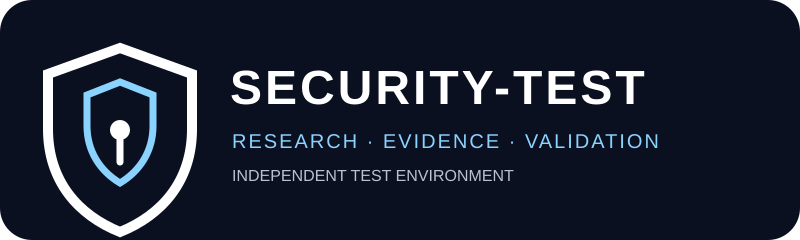

# SECURITY-TEST

RU: Открытый стенд для исследования безопасности, поиска и проверки уязвимостей, анализа атак и разработки защитных механизмов.

EN: An open environment for security research, vulnerability discovery and validation, attack analysis, and defensive mechanism development.

中文：用于安全研究、漏洞发现与验证、攻击分析及防御机制开发的开放环境。

## Mission

SECURITY-TEST is an independent security research and validation environment. It does not own, control, or automatically report to any other repository or organ.

It can test different authorized targets across the ecosystem: SPACE, Guardian, GROWER, AGI, OMEGA, CORE, protocols, interfaces, products, research labs, and external targets where explicit authorization exists.

A target appearing in the map does **not** create an architectural dependency or transfer ownership. Relationships are recorded only when they are explicitly verified.

## Research loop

`SCOPE → MODEL → HYPOTHESIS → TEST → EVIDENCE → VALIDATION → CLASSIFICATION → ROUTING → MITIGATION → REGRESSION`

## Evidence vocabulary

- **FACT** — directly observed information.
- **EVIDENCE** — artifact supporting an observation.
- **HYPOTHESIS** — proposed explanation or attack path.
- **TEST** — controlled procedure used to evaluate it.
- **RESULT** — observed outcome.
- **IMPACT** — demonstrated security consequence.
- **CONCLUSION** — statement supported by the evidence.
- **UNKNOWN** — unresolved point that must not be presented as fact.

## Safety boundary

Research stays inside the target's explicitly authorized scope and rules. No unrelated systems, third-party accounts or data, service disruption, destructive actions, persistence, or irreversible changes. Use the minimum-impact proof necessary to establish a finding.

## Neutral routing principle

SECURITY-TEST produces findings and evidence. The destination is selected **after validation**, based on the nature of the result.

Possible destinations include SPACE, Guardian, SPACE-INTEGRITY, SPACE-SECURITY, CORE, SYSTEM-FOUNDATION, OMEGA, AGI-Lab, GROWER, a product repository, a recovery repository, or another appropriate component.

No destination is the default owner of SECURITY-TEST findings.

## Canonical project map

- `REPOSITORY-REGISTRY.md` — canonical 73-repository inventory anchor.
- `ARCHITECTURE-MAP.md` — ecosystem test-context map; naming does not create dependencies.
- `RESULT-HANDOFF.md` — neutral result-routing contract.
- `SCOPE.md` — authorization and testing boundary.
- `TEST-MATRIX.md` — security property test matrix.
- `FINDING-LIFECYCLE.md` — discovery through regression.
- `CASE_TEMPLATE.md` — standard security research case.
- `METHODOLOGY.md` — research methodology.
- `RULES.md` — operating rules.

## Case IDs

Use `ST-0001`, `ST-0002`, ... for research cases. Preserve target scope, version/commit, environment, timestamps, methodology, evidence, and relevant artifact hashes where practical.

## Status model

`DISCOVERED → HYPOTHESIS → TESTING → VALIDATED / REJECTED → REPORTED → CONFIRMED → MITIGATED → REGRESSION-PASSED`
